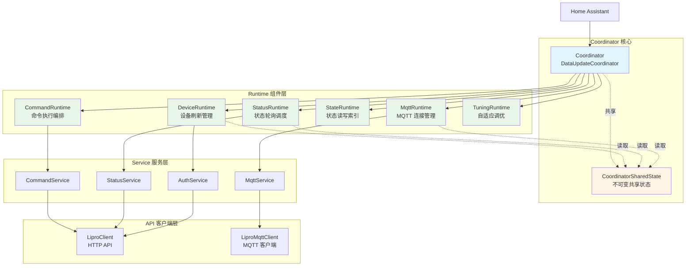
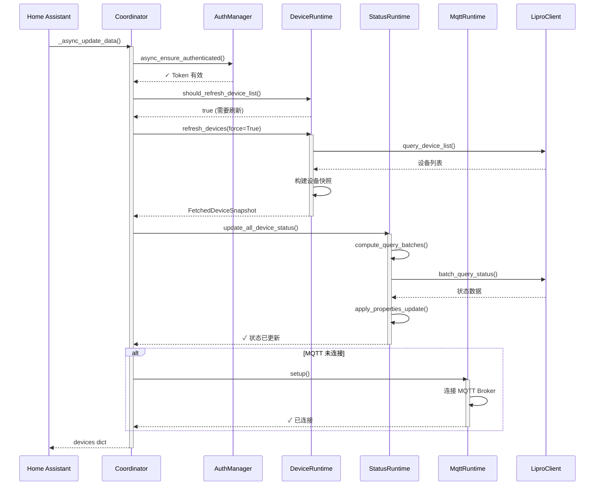
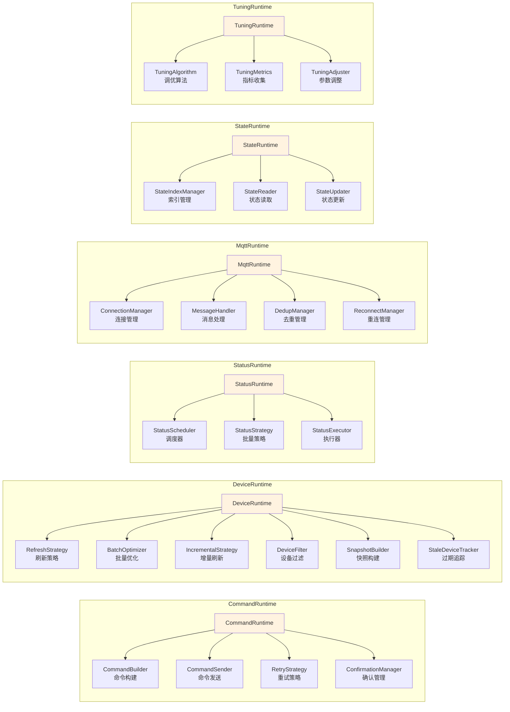
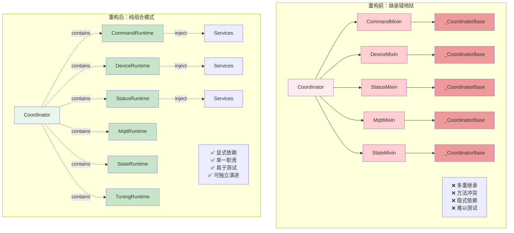
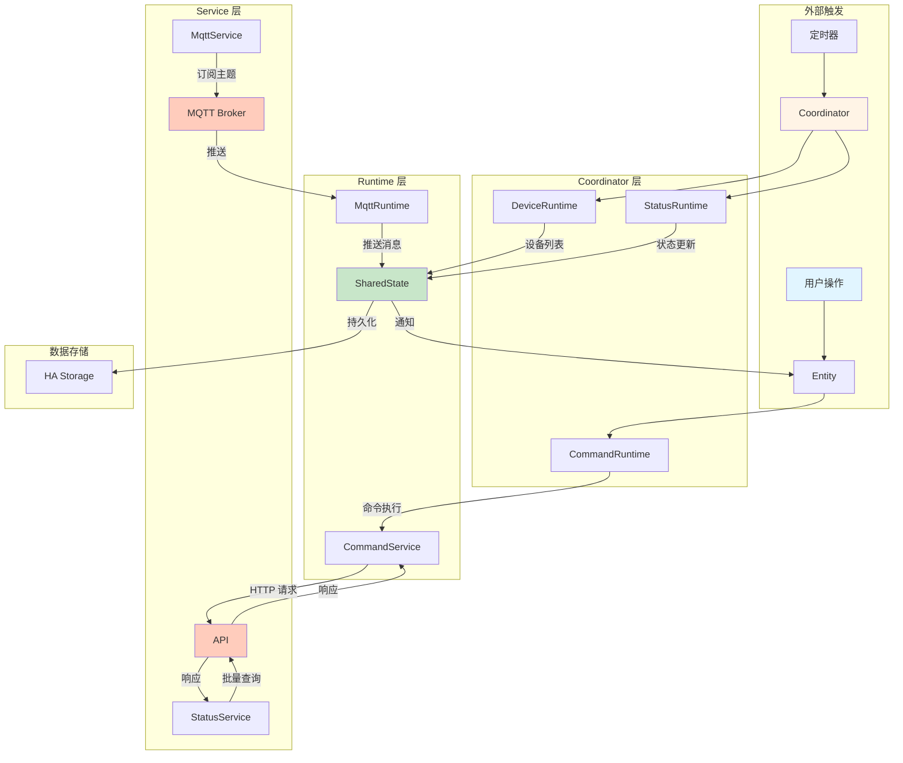
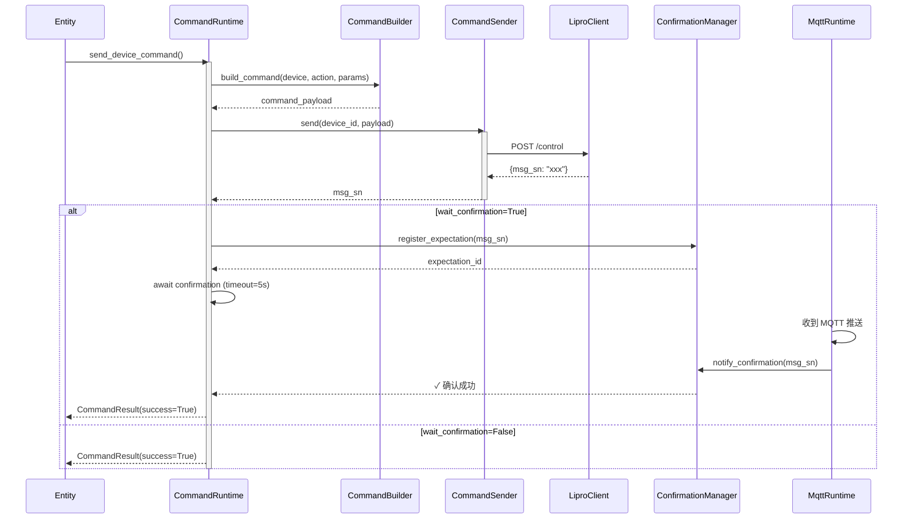
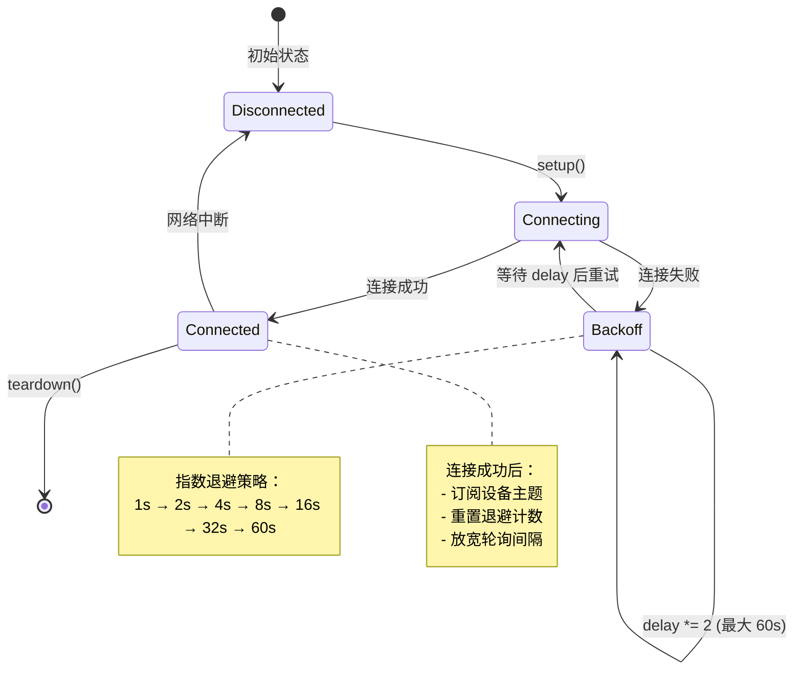
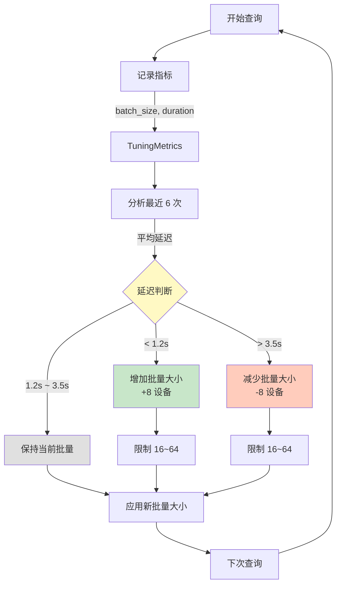
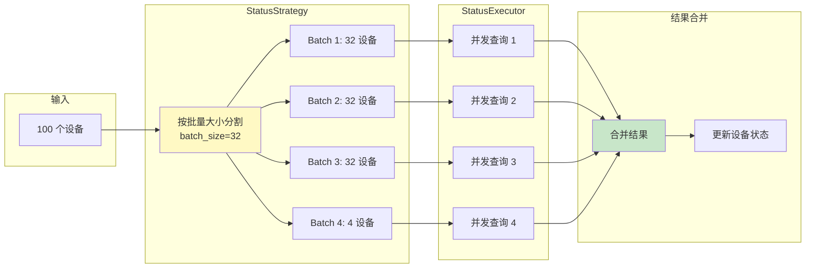

# Coordinator 架构图表

本文档展示重构后的 Coordinator 架构，从继承链迁移到纯组合模式。

---

## 1. 整体架构图

展示 Coordinator 与 6 个 Runtime 的组合关系：

**说明**：
- Coordinator 通过组合持有 6 个独立 Runtime
- SharedState 作为不可变状态容器，被多个 Runtime 共享读取
- Runtime 通过依赖注入获取 Service 和 Client
- 无继承关系，纯组合架构

---

## 2. 主更新循环流程图

展示 `_async_update_data()` 的执行流程：

**说明**：
- 认证检查优先执行
- 设备列表按需刷新（非每次）
- 状态更新采用批量查询优化
- MQTT 连接异步建立

---

## 3. Runtime 组件内部结构图

展示每个 Runtime 的子组件组成：

**说明**：
- 每个 Runtime 由多个专职子组件组成
- 子组件职责单一，可独立测试
- 通过依赖注入组装，无继承耦合

---

## 4. 重构前后对比图

展示从继承链到组合模式的转变：

**说明**：
- **重构前**：多重继承导致方法解析顺序混乱，Mixin 之间隐式依赖 `_CoordinatorBase`
- **重构后**：Coordinator 通过构造函数注入 Runtime，Runtime 通过构造函数注入 Service
- **核心改进**：从"是什么"（继承）到"有什么"（组合）

---

## 5. 依赖注入流程图

展示 Runtime 如何通过依赖注入初始化：

```mermaid
graph LR
    Init[Coordinator.__init__] --> CreateShared[创建 SharedState]

    CreateShared --> InitDevice[初始化 DeviceRuntime]
    InitDevice --> InjectDevice[注入 client, auth_manager,<br/>device_identity_index]

    InjectDevice --> InitStatus[初始化 StatusRuntime]
    InitStatus --> InjectStatus[注入 query_device_status,<br/>apply_properties_update]

    InjectStatus --> InitCommand[初始化 CommandRuntime]
    InitCommand --> InjectCommand[注入 builder, sender,<br/>retry, confirmation]

    InjectCommand --> InitState[初始化 StateRuntime]
    InitState --> InjectState[注入 devices, entities,<br/>device_identity_index]

    InjectState --> InitMqtt[初始化 MqttRuntime]
    InitMqtt --> InjectMqtt[注入 mqtt_client,<br/>polling_updater]

    InjectMqtt --> InitTuning[初始化 TuningRuntime]
    InitTuning --> InjectTuning[注入 batch_size_min/max,<br/>latency_thresholds]

    InjectTuning --> Ready[✓ 就绪]

    style Init fill:#e3f2fd
    style CreateShared fill:#fff9c4
    style Ready fill:#c8e6c9
```

**说明**：
- 所有依赖在构造函数中显式声明
- 无隐式全局状态或单例
- 便于单元测试时 Mock 依赖

---

## 6. 数据流向图

展示数据在各层之间的流动：

**说明**：
- 用户操作通过 Entity 触发 CommandRuntime
- 定时器触发 Coordinator 主循环
- 所有状态变更汇聚到 SharedState
- MQTT 推送实时更新 SharedState

---

## 7. 命令执行生命周期

展示命令从发起到确认的完整流程：

**说明**：
- CommandBuilder 负责构建命令载荷
- CommandSender 负责 HTTP 发送
- ConfirmationManager 追踪 MQTT 确认
- 支持同步/异步两种模式

---

## 8. MQTT 重连策略

展示 MQTT 断线重连的指数退避机制：

**说明**：
- 采用指数退避避免频繁重连
- 最大延迟 60 秒
- 连接成功后重置退避状态

---

## 9. 自适应调优反馈循环

展示 TuningRuntime 如何动态调整批量大小：

**说明**：
- 根据延迟动态调整批量大小
- 避免过大批量导致超时
- 避免过小批量导致请求过多

---

## 10. 状态更新批量优化

展示 StatusRuntime 如何分批查询设备状态：

**说明**：
- 避免单次查询设备过多导致超时
- 批量并发查询提升效率
- 动态调整批量大小适应网络状况

---

## 总结

重构后的架构具备以下优势：

| 维度 | 重构前 | 重构后 |
|------|--------|--------|
| **耦合度** | 多重继承，强耦合 | 纯组合，松耦合 |
| **可测试性** | 难以 Mock 基类 | 依赖注入，易测试 |
| **可维护性** | 方法冲突，难追踪 | 职责清晰，易定位 |
| **可扩展性** | 修改影响全局 | 独立演进，互不影响 |
| **性能** | 无优化 | 自适应调优 |

核心设计原则：

1. **依赖注入**：所有依赖通过构造函数显式传入
2. **单一职责**：每个 Runtime 只负责一个领域
3. **不可变状态**：SharedState 采用 frozen dataclass
4. **组合优于继承**：Runtime 之间无继承关系
5. **协议驱动**：通过 Protocol 定义接口契约
