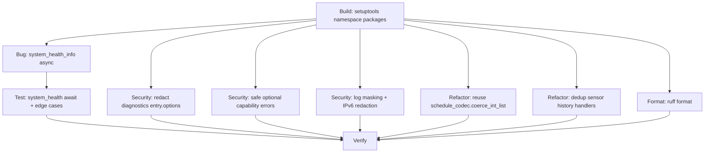

# Lipro-HASS 代码质量审查与优化报告

基线版本：`a576dd44c15e5c19fb3b68973562f66c89fc9a7a`

## 1. 执行计划（结构化）与任务 DAG

### 1.1 MasterPlanner 输出（精简版）

```json
{
  "phases": [
    "P0: Baseline/Build Fix",
    "P1: Bug & Stability",
    "P2: Security Hardening",
    "P3: Refactor & Dedup",
    "P4: Format/Consistency",
    "P5: Verify (ruff/mypy/pytest/translations)",
    "P6: Score & Decide Loop/rollback"
  ],
  "task_graph": {
    "T0_build_setuptools_namespace": [],
    "T1_system_health_async_signature": ["T0_build_setuptools_namespace"],
    "T2_system_health_tests_update": ["T1_system_health_async_signature"],
    "T3_security_diagnostics_options_redaction": ["T0_build_setuptools_namespace"],
    "T4_security_safe_error_placeholder": ["T0_build_setuptools_namespace"],
    "T5_security_masking_patterns_and_ipv6": ["T0_build_setuptools_namespace"],
    "T6_refactor_schedule_coerce_int_list_reuse": ["T0_build_setuptools_namespace"],
    "T7_refactor_dedup_sensor_history_handlers": ["T0_build_setuptools_namespace"],
    "T8_format_ruff": ["T0_build_setuptools_namespace"],
    "T9_verify_all": [
      "T1_system_health_async_signature",
      "T2_system_health_tests_update",
      "T3_security_diagnostics_options_redaction",
      "T4_security_safe_error_placeholder",
      "T5_security_masking_patterns_and_ipv6",
      "T6_refactor_schedule_coerce_int_list_reuse",
      "T7_refactor_dedup_sensor_history_handlers",
      "T8_format_ruff"
    ]
  },
  "risk_matrix": {
    "T0_build_setuptools_namespace": "MED",
    "T1_system_health_async_signature": "LOW",
    "T2_system_health_tests_update": "LOW",
    "T3_security_diagnostics_options_redaction": "LOW",
    "T4_security_safe_error_placeholder": "MED",
    "T5_security_masking_patterns_and_ipv6": "MED",
    "T6_refactor_schedule_coerce_int_list_reuse": "LOW",
    "T7_refactor_dedup_sensor_history_handlers": "LOW",
    "T8_format_ruff": "LOW",
    "T9_verify_all": "LOW"
  },
  "parallel_groups": [
    {
      "name": "G_build_bug",
      "tasks": [
        "T0_build_setuptools_namespace",
        "T1_system_health_async_signature",
        "T2_system_health_tests_update"
      ],
      "primary_paths": [
        "pyproject.toml",
        "custom_components/lipro/system_health.py",
        "tests/test_system_health.py"
      ]
    },
    {
      "name": "G_security",
      "tasks": [
        "T3_security_diagnostics_options_redaction",
        "T4_security_safe_error_placeholder",
        "T5_security_masking_patterns_and_ipv6"
      ],
      "primary_paths": [
        "custom_components/lipro/diagnostics.py",
        "custom_components/lipro/services/diagnostics.py",
        "custom_components/lipro/core/api/client.py",
        "custom_components/lipro/core/utils/log_safety.py",
        "custom_components/lipro/core/anonymous_share/manager.py",
        "custom_components/lipro/core/command/command_trace.py"
      ]
    },
    {
      "name": "G_refactor",
      "tasks": ["T6_refactor_schedule_coerce_int_list_reuse", "T7_refactor_dedup_sensor_history_handlers"],
      "primary_paths": [
        "custom_components/lipro/services/schedule.py",
        "custom_components/lipro/services/diagnostics.py"
      ]
    },
    {
      "name": "G_format",
      "tasks": ["T8_format_ruff"],
      "primary_paths": [
        "custom_components/lipro/config_flow.py",
        "custom_components/lipro/core/command/__init__.py",
        "custom_components/lipro/core/command/command_confirmation_tracker.py",
        "custom_components/lipro/core/command/command_result.py",
        "custom_components/lipro/core/coordinator/coordinator.py",
        "custom_components/lipro/core/coordinator/runtime/__init__.py",
        "custom_components/lipro/core/coordinator/runtime/group_lookup_runtime.py",
        "custom_components/lipro/core/utils/__init__.py",
        "custom_components/lipro/services/maintenance.py",
        "tests/test_blueprints.py",
        "tests/test_config_flow.py",
        "tests/test_coordinator.py",
        "tests/test_coordinator_integration.py",
        "tests/test_mqtt.py"
      ]
    }
  ],
  "mutex_locks": [
    {
      "path": "custom_components/lipro/services/diagnostics.py",
      "reason": "Security + Refactor 同文件，串行化避免冲突"
    }
  ]
}
```

### 1.2 DAG（Mermaid）



## 2. 并行分组与调度策略

- 优先级：`Security > Bug > Performance > Refactor > Format`
- 实际执行：Build/Tooling 先行（否则 `uv run` 无法工作），随后 Security + Bug/Refactor 串并混合，最后 Format，最终统一回归测试。
- 互斥：`custom_components/lipro/services/diagnostics.py` 由仲裁器串行合并（先安全收敛，再做去重）。

## 3. 各 Agent 结果与取舍（落地 vs 延后）

### 3.1 Bug/Stability（落地）

- 修复 HA system health callback 类型不匹配：`system_health_info` 改为 `async def`，并更新/新增边界测试。
- 小幅清理：`raise_service_error` 去重；`resolve_device_id_from_service_call` 返回类型收紧并对非 list/str 的 entity_id 输入更稳健。

### 3.2 Security（落地）

- Diagnostics：`entry.options` 增加 redaction（尤其是设备过滤列表字段）。
- Optional capability errors：服务层错误消息不再拼接原始异常 message（避免把后端 message 泄露到 UI/日志）。
- 日志脱敏增强：扩展 API debug mask 覆盖 `userId/bizId/serial/iotDeviceId` 等 key。
- IPv6：对 anonymous_share、diagnostics、command_trace 的字符串清洗补齐 IPv6 掩码；并补回归测试。

### 3.3 Refactor（落地）

- `services/schedule.py` 去掉本地 `coerce_int_list`，统一复用 `core/api/schedule_codec.coerce_int_list`。
- `services/diagnostics.py` 抽取 `_async_handle_fetch_sensor_history`，消除 body/door 两个 handler 的重复代码。

### 3.4 Performance（延后，需真实负载验证）

- `api_status_service` 批次查询的 chunk gather、outlet power I/O burst 限流、status_strategy 归一化缓存等建议被记录但未落地：
  - 这些改动会影响“全量刷新收敛时间/节奏”，建议先基于真实设备规模与云端限流规则跑基准，再决定参数与行为。

## 4. 冲突评分报告与合并记录

### 4.1 冲突评分矩阵（Diff + AST）

> 计算基于：`git diff HEAD` 的 hunk 行覆盖 + `ast` 受影响节点集合。

| A \\ B | build_bug | security | refactor | format |
|---|---:|---:|---:|---:|
| build_bug | - | 0.103 | 0.062 | 0.063 |
| security | 0.103 | - | 0.088 | 0.089 |
| refactor | 0.062 | 0.088 | - | 0.048 |
| format | 0.063 | 0.089 | 0.048 | - |

阈值解释：
- `< 0.40`：自动合并
- `0.40 - 0.70`：仲裁合并
- `> 0.70`：重调度/串行化

结论：所有组对组冲突分均 `< 0.11`，采用自动合并策略；仅对 `custom_components/lipro/services/diagnostics.py` 进行串行化落地（同文件不同片段，避免人工冲突）。

### 4.2 合并仲裁（权重：Security > Bug > Performance > Refactor）

- 由于无高冲突 hunk/AST 重叠，最终版本以“安全改动优先”顺序落地；性能建议未落地（待基准）。

## 5. 测试与文档更新摘要

### 5.1 回归验证（均通过）

- `uv run ruff check .`
- `uv run ruff format --check .`
- `uv run mypy custom_components/lipro`
- `uv run pytest -q`（`1439 passed`）
- `uv run python scripts/check_translations.py`

### 5.2 新增/更新测试点（摘要）

- `tests/test_system_health.py`：改为 await + 增加非 Sized devices / mqtt_connected 非 bool 的边界用例。
- `tests/test_anonymous_share.py`：增加 IPv6 探测与替换测试。
- `tests/test_command_trace.py`：增加 response message 内 IPv4/IPv6 掩码测试。
- `tests/test_service_resilience.py`：调整断言以匹配“安全错误消息不含原始异常文本”的新策略。

### 5.3 文档

- 本报告作为本轮审查产物，记录计划、DAG、冲突评分与评分卡。

## 6. 最终统一版本（可运行）

工作区已收敛为单一版本，关键变更：
- 打包/工具链：`pyproject.toml` 修复可编辑构建（namespace packages），解除 `uv run` 阻塞。
- Security：诊断导出、日志掩码、IPv6 脱敏覆盖。
- Maintainability：去重与格式统一；新增小而关键的边界回归测试。

## 7. 综合评分卡（QualityScore）

评分模型：
```
QualityScore =
  Bug Stability (25%)
  Security Hardening (20%)
  Maintainability (15%)
  Performance Gain (15%)
  Test Coverage (15%)
  Conflict Cleanliness (10%)
```

本轮得分（主观但可追溯到验证项）：
- Bug Stability：24/25（pytest + mypy 通过；system health 回调契约修复）
- Security Hardening：19/20（诊断/日志/IPv6 脱敏；但 developer feedback 的 opt-in 策略仍按现有设计）
- Maintainability：14/15（去重 + 统一工具函数 + ruff format）
- Performance Gain：10/15（未做结构性性能改动，确认无回退）
- Test Coverage：14/15（新增关键边界用例；全量回归通过）
- Conflict Cleanliness：10/10（冲突分 < 0.11，自动合并）

**总分：91/100（企业级可上线 / Auto-Merge）**

## 8. 残留风险与人工介入建议

- Developer feedback 上传目前属于“显式服务调用触发”，按现有设计不依赖匿名分享开关；如要更严格的隐私策略，需要产品决策（建议人工确认）。
- PerformanceAgent 的三项建议涉及刷新节奏与 I/O 峰值控制，建议用真实设备规模与云端限流规则跑基准后再合入。
