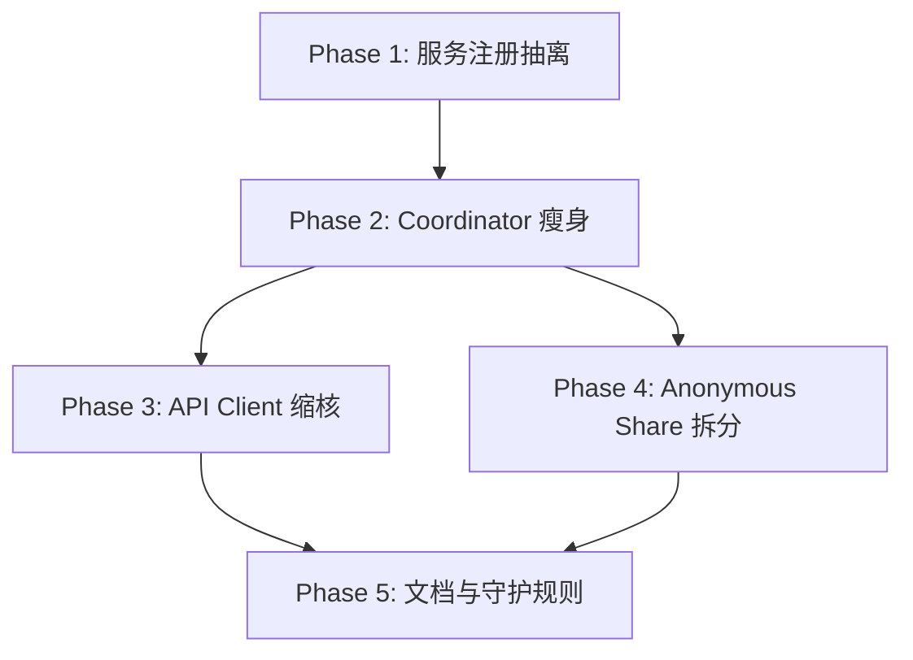

# Lipro 全量重构总计划（保障功能/质量）

## 1. 目标与约束

### 目标
- 在**不改变对外行为**前提下，持续降低核心复杂度与耦合。
- 提升代码可读性、可测试性、可维护性与目录可导航性。
- 将高风险“大文件”拆分为清晰职责模块，减少回归面。

### 约束
- 不降低现有质量门禁：`uv run ruff check .`、`uv run pytest`、覆盖率门槛保持。
- 对外 API（HA service 名称、schema、平台实体行为）保持兼容。
- 每次提交必须原子化，可回滚。

## 2. 现状基线（审查结论）

### 复杂度热点（按 LOC）
- `custom_components/lipro/core/coordinator/coordinator.py`：2600+ 行
- `custom_components/lipro/core/api/client.py`：1800+ 行
- `custom_components/lipro/core/anonymous_share/manager.py`：1300+ 行
- `custom_components/lipro/update.py`：900+ 行
- `custom_components/lipro/__init__.py`：800+ 行

### 架构问题
- 协调器承担过多职责（轮询/MQTT/命令确认/设备同步/回收策略混合）。
- API 客户端入口过大（签名、重试、节流、认证、业务端点混在同层）。
- 入口文件 `__init__.py` 承担过多服务编排细节。
- 部分目录边界虽然已存在，但“注册/装配/运行策略”仍有交叉耦合。

## 3. 目标架构（演进态）

### 分层
- **Integration Adapter 层**：`__init__.py`、平台实体文件，仅负责 HA 接入与装配。
- **Application Service 层**：`services/*`，负责用例编排、输入契约、错误翻译。
- **Domain Core 层**：`core/device`、`core/command`、`core/coordinator/runtime`，纯业务策略与状态机（面向 coordinator 的纯函数决策）。
- **Infrastructure 层**：`core/api/*`、`core/mqtt/*`、`core/auth/*`，协议与传输实现。
- **Cross-cutting 层**：`core/utils/*`、`diagnostics.py`、`system_health.py`。

### 目录治理目标
- 服务注册逻辑放入 `services/` 子域，不再堆叠在入口文件。
- 新增模块必须有单一职责、文件名与职责一致、依赖方向单向。
- 优先复用 `core/coordinator/runtime/*` 的纯函数策略，减少在 `core/coordinator/coordinator.py` 直接堆逻辑。

## 4. 目标目录结构（演进草图）

```text
custom_components/lipro/
  __init__.py                  # 仅保留装配与生命周期
  services/
    contracts.py               # service schema 与常量
    registry.py                # service 注册/反注册/批量装配
    command.py
    schedule.py
    diagnostics.py
    maintenance.py
    share.py
    device_lookup.py
  core/
    coordinator/coordinator.py # 渐进瘦身为 orchestrator
    coordinator/runtime/       # 纯策略模块（持续扩容）
    command/                   # 命令派发/确认/追踪
    api/                       # 传输与 endpoint 逻辑
    mqtt/                      # push 通道与订阅生命周期
    auth/
    device/
    utils/
```

## 5. 分阶段重构路线图

### Phase 0（已完成）：风险止血与回归补齐
- 并发节流锁竞态修复。
- 多实体同设备路由兼容恢复。
- MQTT on_connect 错误可观测性恢复。
- 对应测试补齐并全量通过。

### Phase 1（本次完成）：入口解耦与目录完善
- 抽离 service 注册能力到 `services/registry.py`。
- `__init__.py` 从“注册细节实现者”降级为“注册配置装配者”。
- `maintenance` 内部状态简化，去除无效中间列表。

### Phase 2：Coordinator 责任拆分（高优先）
- 从 `core/coordinator/coordinator.py` 继续提炼：
  - 设备刷新与清理策略到 `core/coordinator/runtime/device_refresh_runtime.py`（新）
  - MQTT 对账调度策略到 `core/coordinator/runtime/mqtt_reconcile_runtime.py`（新）
  - 指标/自适应参数逻辑到 `core/coordinator/runtime/metrics_runtime.py`（新）
- 每次只拆一块，拆后补充同名测试模块。

### Phase 3：API Client 缩核
- 将 `core/api/client.py` 中重试/节流/签名路径进一步模块化：
  - 请求执行器（transport executor）
  - 认证恢复策略（auth recovery policy）
  - 端点领域服务（status/schedule/diagnostics 已有，继续推进）

### Phase 4：匿名上报域拆分
- `core/anonymous_share/manager.py` 拆为：
  - sanitizer
  - storage
  - uploader
  - coordinator/manager
- 对 singleton fallback 增加边界测试与生命周期测试。

### Phase 5：文档与架构守护
- 每次重构同步更新 `docs/developer_architecture.md`。
- 增加“依赖方向检查”测试（防止 adapter 层反向依赖 runtime 细节）。

## 6. 任务依赖 DAG（Mermaid）



## 7. 质量门禁与验收标准

每个阶段必须满足：
- `uv run ruff check .` 通过。
- `uv run pytest` 全量通过。
- 不降低覆盖率门槛（CI 当前 `--cov-fail-under=95`）。
- 对外 service 契约与错误翻译键不变。
- 平台实体行为（状态、命令路径、可用性）无回归。

## 8. 风险控制与回滚策略

- 小步提交：每个提交只做一类重构。
- 失败即回退：通过 `git revert <commit>` 回滚单阶段改造。
- 高风险文件（`core/coordinator/coordinator.py`、`core/api/client.py`）采用“旁路提炼 + 原入口委托”方式，避免一次性大改。
- 所有目录迁移优先采用兼容导出与回归测试保护，避免外部导入断裂。

## 9. 执行优先级建议（下一步）

1. 继续 Phase 2：先拆 `coordinator` 的 stale-device 清理与 room-sync 相关逻辑。  
2. 再做 Phase 3：抽离 API 请求执行器，减少 `core/api/client.py` 体积。  
3. 每完成一个子阶段即提交并跑全量测试，保持可回滚与低风险。  
