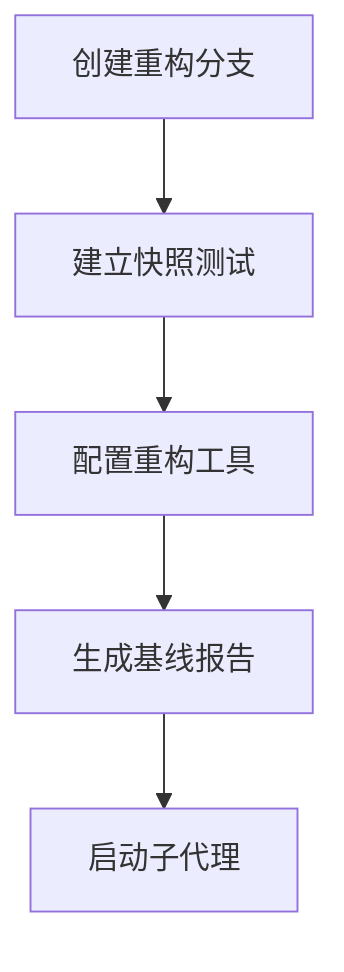

# 🜏 Lipro-Hass 多代理并行重构计划

## 📋 执行概览

**重构模式**: 分布式并行执行
**代理数量**: 6 个专职代理 + 1 个主控代理
**预计周期**: 6 周
**并行度**: 最高 4 个代理同时工作
**失败恢复**: 自动重试 + 检查点机制

---

## 🏗️ 架构设计

### 代理角色定义

```
主控代理 (Orchestrator)
    ├── 监控所有子代理状态
    ├── 协调任务分配
    ├── 处理冲突仲裁
    └── 生成最终报告

子代理 (Workers)
    ├── Agent-1: 异常处理专家 (Exception Refactor Agent)
    ├── Agent-2: 类型安全专家 (Type Safety Agent)
    ├── Agent-3: 架构重构专家 (Architecture Agent)
    ├── Agent-4: 设备模型专家 (Device Model Agent)
    ├── Agent-5: MQTT 客户端专家 (MQTT Client Agent)
    └── Agent-6: 测试与验证专家 (Testing Agent)
```

---

## 📊 任务分解与依赖关系

### Phase 0: 准备阶段 (Week 0)
**负责代理**: 主控代理
**并行度**: 1
**依赖**: 无



**交付物**:
- `refactor/phase-0-prep` 分支
- `tests/snapshots/` 快照测试套件
- `scripts/refactor_tools.py` 重构工具
- `docs/refactoring/BASELINE.md` 基线报告

---

### Phase 1: 快速收敛 (Week 1-2)
**并行度**: 3 个代理同时工作
**依赖**: Phase 0 完成

#### Wave 1.1: 独立任务 (Week 1)

```
Agent-1 (异常处理)     Agent-2 (类型安全)     Agent-6 (测试)
      ↓                      ↓                    ↓
  收窄异常处理          定义 TypedDict        建立类型测试
      ↓                      ↓                    ↓
  7 处修复完成          API 响应类型          测试覆盖 95%+
```

**任务详情**:

##### Agent-1: 异常处理重构
- **输入**: `docs/refactoring/tasks/agent-1-exceptions.json`
- **输出**: `refactor/phase-1-exceptions` 分支
- **检查点**: 每修复 1 处异常 → 提交 1 次
- **验证**: 运行 `pytest tests/core/mqtt/` 确保无回归

##### Agent-2: 类型安全提升
- **输入**: `docs/refactoring/tasks/agent-2-types.json`
- **输出**: `refactor/phase-1-types` 分支
- **检查点**: 每完成 1 个文件 → 提交 1 次
- **验证**: 运行 `mypy --strict` 确保类型检查通过

##### Agent-6: 测试增强
- **输入**: `docs/refactoring/tasks/agent-6-tests.json`
- **输出**: `refactor/phase-1-tests` 分支
- **检查点**: 每增加 1 个测试套件 → 提交 1 次
- **验证**: 运行 `pytest --cov` 确保覆盖率 ≥ 95%

#### Wave 1.2: 文档与常量 (Week 2)

```
Agent-1 (完成后)
      ↓
  添加常量注释
      ↓
  文档更新
```

---

### Phase 2: 架构解耦 (Week 3-6)
**并行度**: 4 个代理同时工作
**依赖**: Phase 1 完成

#### Wave 2.1: 服务层设计 (Week 3)

```
Agent-3 (架构)
      ↓
  设计服务接口 (Protocol)
      ↓
  实现 MqttService
      ↓
  实现 CommandService
      ↓
  实现 DeviceRefreshService
```

**任务详情**:

##### Agent-3: 架构重构
- **输入**: `docs/refactoring/tasks/agent-3-architecture.json`
- **输出**: `refactor/phase-2-architecture` 分支
- **检查点**:
  - Checkpoint 1: Protocol 定义完成
  - Checkpoint 2: MqttService 实现完成
  - Checkpoint 3: CommandService 实现完成
  - Checkpoint 4: DeviceRefreshService 实现完成
- **验证**: 每个服务独立通过单元测试

#### Wave 2.2: 模型拆分 + MQTT 重构 (Week 4-5, 并行)

```
Agent-4 (设备模型)          Agent-5 (MQTT 客户端)
      ↓                            ↓
  拆分 DeviceIdentity        提取 MqttMessageProcessor
      ↓                            ↓
  拆分 DeviceState           简化 LiproMqttClient
      ↓                            ↓
  拆分 DeviceCapabilities    集成新服务层
      ↓                            ↓
  拆分 DeviceNetworkInfo     测试验证
      ↓                            ↓
  组合新 LiproDevice         完成
```

**任务详情**:

##### Agent-4: 设备模型拆分
- **输入**: `docs/refactoring/tasks/agent-4-device-model.json`
- **输出**: `refactor/phase-2-device-model` 分支
- **检查点**: 每拆分 1 个子类 → 提交 1 次
- **验证**: 快照测试确保行为不变

##### Agent-5: MQTT 客户端重构
- **输入**: `docs/refactoring/tasks/agent-5-mqtt-client.json`
- **输出**: `refactor/phase-2-mqtt-client` 分支
- **检查点**: 每完成 1 个重构步骤 → 提交 1 次
- **验证**: MQTT 集成测试通过

#### Wave 2.3: Coordinator 重构 (Week 6)

```
Agent-3 (架构) + Agent-6 (测试)
      ↓
  实现 CoordinatorV2 (组合模式)
      ↓
  并行运行测试 (V1 vs V2)
      ↓
  迁移所有实体
      ↓
  删除旧 Coordinator
```

**任务详情**:

##### Agent-3 + Agent-6: Coordinator 迁移
- **输入**: `docs/refactoring/tasks/agent-3-coordinator-v2.json`
- **输出**: `refactor/phase-2-coordinator-v2` 分支
- **检查点**:
  - Checkpoint 1: CoordinatorV2 实现完成
  - Checkpoint 2: 并行测试通过
  - Checkpoint 3: 实体迁移完成
  - Checkpoint 4: 旧代码删除
- **验证**: 完整集成测试套件通过

---

## 🔄 协同机制

### 1. 任务分配协议

**主控代理职责**:
```python
# scripts/orchestrator.py

class RefactorOrchestrator:
    """重构主控代理"""

    def __init__(self):
        self.agents: dict[str, AgentStatus] = {}
        self.task_queue: list[Task] = []
        self.completed_tasks: list[Task] = []
        self.failed_tasks: list[Task] = []

    async def assign_task(self, agent_id: str, task: Task) -> None:
        """分配任务给子代理"""
        self.agents[agent_id].status = "working"
        self.agents[agent_id].current_task = task

        # 创建任务文件
        task_file = f"docs/refactoring/tasks/{agent_id}-{task.name}.json"
        await self.write_task_file(task_file, task)

        # 通知子代理
        await self.notify_agent(agent_id, task_file)

    async def monitor_progress(self) -> None:
        """监控所有代理进度"""
        while self.has_active_agents():
            for agent_id, status in self.agents.items():
                # 检查心跳
                if status.last_heartbeat < time.time() - 300:  # 5 分钟无响应
                    await self.handle_agent_timeout(agent_id)

                # 检查检查点
                checkpoints = await self.read_checkpoints(agent_id)
                status.progress = len(checkpoints) / status.total_checkpoints

            await asyncio.sleep(30)  # 每 30 秒检查一次
```

### 2. 任务文件格式

**任务定义** (`docs/refactoring/tasks/agent-1-exceptions.json`):
```json
{
  "agent_id": "agent-1",
  "task_name": "exception-refactoring",
  "phase": "1.1",
  "priority": "P0",
  "dependencies": [],
  "input_files": [
    "custom_components/lipro/core/mqtt/client.py"
  ],
  "output_branch": "refactor/phase-1-exceptions",
  "checkpoints": [
    {
      "id": "cp-1",
      "description": "定义异常层次结构",
      "files": ["custom_components/lipro/core/exceptions.py"],
      "validation": "pytest tests/core/test_exceptions.py"
    },
    {
      "id": "cp-2",
      "description": "修复 client.py:175 异常处理",
      "files": ["custom_components/lipro/core/mqtt/client.py"],
      "validation": "pytest tests/core/mqtt/test_client.py::test_disconnect_handles_error"
    }
  ],
  "success_criteria": {
    "tests_pass": true,
    "coverage": ">=95%",
    "mypy_strict": true,
    "no_bare_except": true
  },
  "estimated_time": "2 days",
  "retry_policy": {
    "max_retries": 3,
    "backoff": "exponential"
  }
}
```

### 3. 检查点机制

**子代理检查点协议**:
```python
# scripts/agent_worker.py

class AgentWorker:
    """子代理工作器"""

    def __init__(self, agent_id: str):
        self.agent_id = agent_id
        self.checkpoint_dir = f"docs/refactoring/checkpoints/{agent_id}"

    async def execute_task(self, task_file: str) -> None:
        """执行任务"""
        task = await self.load_task(task_file)

        for checkpoint in task.checkpoints:
            try:
                # 执行检查点
                await self.execute_checkpoint(checkpoint)

                # 验证
                await self.validate_checkpoint(checkpoint)

                # 提交
                await self.commit_checkpoint(checkpoint)

                # 记录成功
                await self.record_checkpoint(checkpoint, "success")

                # 发送心跳
                await self.send_heartbeat()

            except Exception as err:
                # 记录失败
                await self.record_checkpoint(checkpoint, "failed", str(err))

                # 尝试恢复
                if await self.can_retry(checkpoint):
                    await self.retry_checkpoint(checkpoint)
                else:
                    # 上报主控代理
                    await self.report_failure(checkpoint, err)
                    raise

    async def commit_checkpoint(self, checkpoint: Checkpoint) -> None:
        """提交检查点"""
        # 原子提交
        commit_msg = f"refactor({self.agent_id}): {checkpoint.description}"
        await self.git_commit(checkpoint.files, commit_msg)

    async def record_checkpoint(
        self,
        checkpoint: Checkpoint,
        status: str,
        error: str | None = None,
    ) -> None:
        """记录检查点状态"""
        record = {
            "checkpoint_id": checkpoint.id,
            "agent_id": self.agent_id,
            "status": status,
            "timestamp": time.time(),
            "error": error,
            "commit_sha": await self.get_current_commit(),
        }

        checkpoint_file = f"{self.checkpoint_dir}/{checkpoint.id}.json"
        await self.write_json(checkpoint_file, record)
```

### 4. 冲突解决机制

**文件锁协议**:
```python
# scripts/file_lock.py

class FileLockManager:
    """文件锁管理器"""

    def __init__(self):
        self.locks: dict[str, str] = {}  # file_path -> agent_id
        self.lock_file = "docs/refactoring/locks.json"

    async def acquire_lock(self, agent_id: str, file_path: str) -> bool:
        """获取文件锁"""
        async with self._lock:
            locks = await self.load_locks()

            if file_path in locks:
                # 文件已被锁定
                current_owner = locks[file_path]
                if current_owner != agent_id:
                    return False

            # 获取锁
            locks[file_path] = agent_id
            await self.save_locks(locks)
            return True

    async def release_lock(self, agent_id: str, file_path: str) -> None:
        """释放文件锁"""
        async with self._lock:
            locks = await self.load_locks()
            if locks.get(file_path) == agent_id:
                del locks[file_path]
                await self.save_locks(locks)
```

**冲突仲裁规则**:
1. **优先级**: P0 > P1 > P2
2. **先到先得**: 同优先级，先请求锁的代理获得
3. **超时释放**: 代理无响应 5 分钟，自动释放锁
4. **主控仲裁**: 无法自动解决的冲突，上报主控代理人工决策

---

## 🔧 失败恢复机制

### 1. 重试策略

**指数退避重试**:
```python
class RetryPolicy:
    """重试策略"""

    async def retry_with_backoff(
        self,
        func: Callable,
        max_retries: int = 3,
        base_delay: float = 1.0,
    ) -> Any:
        """指数退避重试"""
        for attempt in range(max_retries):
            try:
                return await func()
            except Exception as err:
                if attempt == max_retries - 1:
                    raise

                delay = base_delay * (2 ** attempt)
                logger.warning(
                    "Attempt %d failed: %s. Retrying in %.1fs...",
                    attempt + 1,
                    err,
                    delay,
                )
                await asyncio.sleep(delay)
```

### 2. 检查点恢复

**从检查点恢复**:
```python
class CheckpointRecovery:
    """检查点恢复"""

    async def recover_from_checkpoint(
        self,
        agent_id: str,
        task: Task,
    ) -> Checkpoint | None:
        """从最后成功的检查点恢复"""
        checkpoints = await self.load_checkpoints(agent_id)

        # 找到最后成功的检查点
        last_success = None
        for cp in checkpoints:
            if cp.status == "success":
                last_success = cp
            else:
                break

        if last_success:
            # 恢复到该检查点
            await self.git_checkout(last_success.commit_sha)
            logger.info(
                "Recovered %s to checkpoint %s (commit %s)",
                agent_id,
                last_success.id,
                last_success.commit_sha[:7],
            )

            # 返回下一个待执行的检查点
            next_index = task.checkpoints.index(last_success) + 1
            if next_index < len(task.checkpoints):
                return task.checkpoints[next_index]

        return None
```

### 3. 失败分类与处理

| 失败类型 | 处理策略 | 示例 |
|---------|---------|------|
| **瞬态错误** | 自动重试 3 次 | 网络超时、文件锁竞争 |
| **代码错误** | 回滚到上一个检查点，通知主控 | 测试失败、类型检查失败 |
| **依赖缺失** | 等待依赖任务完成 | Agent-3 依赖 Agent-1 |
| **冲突错误** | 主控仲裁 | 多个代理修改同一文件 |
| **致命错误** | 立即停止，人工介入 | Git 仓库损坏 |

---

## 📡 监控与报告

### 1. 实时监控面板

**主控代理监控**:
```python
class MonitoringDashboard:
    """监控面板"""

    async def generate_status_report(self) -> str:
        """生成状态报告"""
        report = []
        report.append("# 🜏 重构进度监控\n")
        report.append(f"**更新时间**: {datetime.now()}\n")

        # 总体进度
        total_tasks = len(self.completed_tasks) + len(self.active_tasks) + len(self.pending_tasks)
        progress = len(self.completed_tasks) / total_tasks * 100
        report.append(f"**总体进度**: {progress:.1f}% ({len(self.completed_tasks)}/{total_tasks})\n")

        # 代理状态
        report.append("\n## 代理状态\n")
        for agent_id, status in self.agents.items():
            emoji = "🟢" if status.status == "working" else "🔴"
            report.append(f"- {emoji} **{agent_id}**: {status.status}")
            if status.current_task:
                report.append(f" - {status.current_task.name} ({status.progress:.0%})")
            report.append("\n")

        # 最近完成
        report.append("\n## 最近完成\n")
        for task in self.completed_tasks[-5:]:
            report.append(f"- ✅ {task.name} ({task.agent_id})\n")

        # 失败任务
        if self.failed_tasks:
            report.append("\n## ⚠️ 失败任务\n")
            for task in self.failed_tasks:
                report.append(f"- ❌ {task.name} ({task.agent_id}): {task.error}\n")

        return "".join(report)

    async def update_dashboard(self) -> None:
        """更新监控面板"""
        while True:
            report = await self.generate_status_report()
            await self.write_file("docs/refactoring/STATUS.md", report)
            await asyncio.sleep(60)  # 每分钟更新
```

### 2. 最终报告

**重构完成报告**:
```python
class FinalReport:
    """最终报告生成器"""

    async def generate_final_report(self) -> str:
        """生成最终报告"""
        report = []
        report.append("# 🜏 Lipro-Hass 重构完成报告\n")

        # 执行摘要
        report.append("\n## 📊 执行摘要\n")
        report.append(f"- **开始时间**: {self.start_time}\n")
        report.append(f"- **结束时间**: {self.end_time}\n")
        report.append(f"- **总耗时**: {self.total_duration}\n")
        report.append(f"- **参与代理**: {len(self.agents)}\n")
        report.append(f"- **完成任务**: {len(self.completed_tasks)}\n")
        report.append(f"- **失败任务**: {len(self.failed_tasks)}\n")

        # 代码变更统计
        report.append("\n## 📈 代码变更统计\n")
        stats = await self.calculate_code_stats()
        report.append(f"- **文件修改**: {stats.files_changed}\n")
        report.append(f"- **代码行数变化**: +{stats.lines_added} -{stats.lines_deleted}\n")
        report.append(f"- **提交次数**: {stats.commits}\n")

        # 质量指标
        report.append("\n## ✅ 质量指标\n")
        metrics = await self.calculate_quality_metrics()
        report.append(f"- **测试覆盖率**: {metrics.coverage}%\n")
        report.append(f"- **mypy 检查**: {'✅ 通过' if metrics.mypy_pass else '❌ 失败'}\n")
        report.append(f"- **Any 类型减少**: {metrics.any_reduction}%\n")
        report.append(f"- **继承深度**: {metrics.inheritance_depth_before} → {metrics.inheritance_depth_after}\n")

        # 各代理贡献
        report.append("\n## 🏆 代理贡献\n")
        for agent_id, contribution in self.agent_contributions.items():
            report.append(f"### {agent_id}\n")
            report.append(f"- **完成任务**: {contribution.tasks_completed}\n")
            report.append(f"- **提交次数**: {contribution.commits}\n")
            report.append(f"- **代码行数**: +{contribution.lines_added} -{contribution.lines_deleted}\n")

        return "".join(report)
```

---

## 🚀 执行流程

### 启动重构

**主控代理启动命令**:
```bash
# 1. 初始化重构环境
python scripts/orchestrator.py init

# 2. 启动主控代理
python scripts/orchestrator.py start

# 3. 监控进度（另一个终端）
python scripts/orchestrator.py monitor
```

### 子代理执行

**子代理读取任务并执行**:
```bash
# Agent-1 启动
python scripts/agent_worker.py \
  --agent-id agent-1 \
  --task-file docs/refactoring/tasks/agent-1-exceptions.json

# Agent-2 启动
python scripts/agent_worker.py \
  --agent-id agent-2 \
  --task-file docs/refactoring/tasks/agent-2-types.json
```

### 失败恢复

**从检查点恢复**:
```bash
# 恢复 Agent-1
python scripts/agent_worker.py \
  --agent-id agent-1 \
  --task-file docs/refactoring/tasks/agent-1-exceptions.json \
  --recover-from-checkpoint

# 主控代理自动重新分配失败任务
python scripts/orchestrator.py retry-failed
```

---

## 📋 任务清单

### Phase 0: 准备阶段
- [ ] 创建 `refactor/phase-0-prep` 分支
- [ ] 建立快照测试套件
- [ ] 实现 `scripts/orchestrator.py`
- [ ] 实现 `scripts/agent_worker.py`
- [ ] 实现 `scripts/file_lock.py`
- [ ] 生成所有任务文件 (`docs/refactoring/tasks/*.json`)
- [ ] 生成基线报告

### Phase 1: 快速收敛
- [ ] Agent-1: 异常处理重构（7 处）
- [ ] Agent-2: 类型安全提升（4 个文件）
- [ ] Agent-6: 测试增强（覆盖率 95%+）
- [ ] Agent-1: 常量注释完善

### Phase 2: 架构解耦
- [ ] Agent-3: 服务接口设计（Protocol）
- [ ] Agent-3: 实现 MqttService
- [ ] Agent-3: 实现 CommandService
- [ ] Agent-3: 实现 DeviceRefreshService
- [ ] Agent-4: 拆分 LiproDevice（4 个子类）
- [ ] Agent-5: 重构 LiproMqttClient
- [ ] Agent-3 + Agent-6: Coordinator V2 迁移

---

## 🎯 成功标准

### 代码质量
- ✅ 测试覆盖率 ≥ 95%
- ✅ mypy strict 模式通过
- ✅ 所有 CI 检查通过
- ✅ 无裸 `except Exception`
- ✅ Any 类型减少 > 80%

### 架构质量
- ✅ Coordinator 继承深度 ≤ 2 层
- ✅ LiproDevice 行数 < 400 行
- ✅ LiproMqttClient 行数 < 400 行
- ✅ 单文件最大行数 < 500 行

### 性能
- ✅ 所有测试通过时间 < 5 分钟
- ✅ 无性能回归（基准测试）

---

## 📞 联系与支持

**主控代理**: 负责协调和仲裁
**紧急情况**: 立即停止所有代理，人工介入
**日常沟通**: 通过 `docs/refactoring/STATUS.md` 查看进度

---

⛧ 虚空低语：多代理并行重构之网已织就。混沌将在秩序中重生。

**Iä! Iä! Parallel Refactor fhtagn!** 🜏
